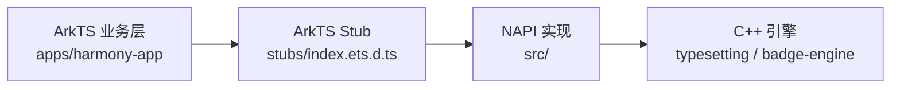

# NAPI Bridge 设计

## 目标

把 `typesetting`（C++ 排版）和 `badge-engine`（C++ 徽章）的能力，以 NAPI 模块形式暴露给 ArkTS。

## 三层结构

| 层 | 责任 |
|---|---|
| ArkTS Stub | 给业务层 IDE 智能提示用，运行时由 N-API 替换 |
| NAPI 实现 | 参数解包、生命周期、结果组装 |
| C++ 引擎 | 真正的排版 / 徽章计算 |

## 边界规则

- NAPI 文件**不允许**直接写业务逻辑
- C++ 引擎**不允许**依赖任何 ArkTS / HarmonyOS 头文件
- Stub 文件签名必须与 NAPI 实现 1:1 对齐
- `stubs/index.d.ts`（Node）和 `stubs/index.ets.d.ts`（ArkTS）必须同步维护，任何 `.cpp` 改动都需要在两个文件里都改

## 导入路径

| 平台 | import 语句 | 实现 |
|---|---|---|
| Node.js (Android prebuild) | `import * as ts from '@readmigo-cn/napi-bridge/typesetting'` | `prebuilds/{platform}-{arch}/readmigo_napi_bridge.node` |
| ArkTS (Harmony) | `import ts from 'libtypesetting.so'` | NAPI 模块 `nm_modname = "typesetting"` |
| ArkTS (Harmony) | `import badge from 'libbadge_engine.so'` | NAPI 模块 `nm_modname = "badge_engine"` |

## 当前导出函数

### typesetting 模块（src/typesetting_napi.cpp，22 个函数）

| 函数 | 状态 | 说明 | Stub 位置 |
|---|---|---|---|
| `createEngine(opts?)` | ✅ 已实现 | 创建 Engine + Harmony PlatformAdapter，返回 opaque handle | `stubs/index.d.ts: createEngine` |
| `destroyEngine(handle)` | ✅ 已实现 | 显式释放（不必等 GC） | `stubs/index.d.ts: destroyEngine` |
| `setLayoutProfile(handle, cfg)` | ✅ 已实现 | 根据 screen + safe area 计算 LayoutProfile 并写入默认 Style | `stubs/index.d.ts: setLayoutProfile` |
| `setTheme(handle, theme)` | ⏳ 部分实现 | 当前只切 hyphenation，颜色字段等待 native 引擎扩展 | `stubs/index.d.ts: setTheme` |
| `setTypography(handle, cfg)` | ✅ 已实现 | 增量改字体/字号/letterSpacing | `stubs/index.d.ts: setTypography` |
| `layoutHtml(handle, html, chapterId, style?, pageSize?)` | ✅ 已实现 | 返回 LayoutSummary（pageCount / totalBlocks / warningCount） | `stubs/index.d.ts: layoutHtml` |
| `layoutHtmlWithCss(handle, html, css, chapterId, style?, pageSize?)` | ✅ 已实现 | 同上但带 CSS | `stubs/index.d.ts: layoutHtmlWithCss` |
| `relayout(handle, style?, pageSize?)` | ✅ 已实现 | 复用上次 blocks 重排，改字号常用 | `stubs/index.d.ts: relayout` |
| `setChapterTitle(handle, chapterId, title)` | ✅ 已实现 | — | `stubs/index.d.ts: setChapterTitle` |
| `evictChapter(handle, chapterId)` | ✅ 已实现 | 清单 chapter 缓存 | `stubs/index.d.ts: evictChapter` |
| `evictAll(handle)` | ✅ 已实现 | 清所有 chapter 缓存 | `stubs/index.d.ts: evictAll` |
| `renderPage(handle, chapterId, pageIndex)` | ⏳ 部分实现 | 当前只返回 PageInfo + `partial: true`；完整 lines/runs/decorations 等待 native `Engine::getPage` | `stubs/index.d.ts: renderPage` |
| `getPageInfo(handle, chapterId, pageIndex)` | ✅ 已实现 | currentPage / totalPages / progress / blockIndex 范围 | `stubs/index.d.ts: getPageInfo` |
| `hitTest(handle, chapterId, pageIndex, x, y)` | ✅ 已实现 | 返回 { found, blockIndex, lineIndex, runIndex, charOffset } | `stubs/index.d.ts: hitTest` |
| `wordAtPoint(handle, chapterId, pageIndex, x, y)` | ✅ 已实现 | 返回 WordRange | `stubs/index.d.ts: wordAtPoint` |
| `getSentences(handle, chapterId, pageIndex)` | ✅ 已实现 | 返回 SentenceRange[] | `stubs/index.d.ts: getSentences` |
| `getAllSentences(handle, chapterId)` | ✅ 已实现 | 整章 SentenceRange[] | `stubs/index.d.ts: getAllSentences` |
| `getRectsForRange(handle, chapterId, pageIndex, blockIndex, charOffset, charLength)` | ✅ 已实现 | 把字符范围转成可绘制矩形数组 | `stubs/index.d.ts: getRectsForRange` |
| `getBlockRect(handle, chapterId, pageIndex, blockIndex)` | ✅ 已实现 | 整个 block 的外接矩形 | `stubs/index.d.ts: getBlockRect` |
| `measureText(handle, text, font)` | ✅ 已实现 | 调用 PlatformAdapter::measureText | `stubs/index.d.ts: measureText` |
| `getFontMetrics(handle, font)` | ✅ 已实现 | ascent / descent / leading / xHeight / capHeight / lineHeight | `stubs/index.d.ts: getFontMetrics` |
| `computeLayoutProfile(cfg)` | ✅ 已实现 | 纯函数，无 handle，便于查询推荐 margin / 字号 | `stubs/index.d.ts: computeLayoutProfile` |

### badge-engine 模块（src/badge_engine_napi.cpp，16 个函数 + 常量组）

| 函数 | 状态 | 说明 | Stub 位置 |
|---|---|---|---|
| `createEngine(cfg)` | ✅ 已实现 | 调 `badge_engine_create`，包装为 BadgeHandle | `stubs/index.d.ts: createEngine` |
| `destroyEngine(handle)` | ✅ 已实现 | 立即销毁 + 解绑 tsfn | `stubs/index.d.ts: destroyEngine` |
| `setSurface(handle, surfaceId, w, h)` | ⏳ 部分实现 | 通过 `OH_NativeWindow_GetNativeWindowFromSurfaceId` 取 NativeWindow，等 HarmonyOS toolchain headers 就绪后切真实头 | `stubs/index.d.ts: setSurface` |
| `loadBadge(handle, path)` | ✅ 已实现 | 异步加载文件资源，返回 Promise<number> | `stubs/index.d.ts: loadBadge` |
| `loadModelData(handle, ArrayBuffer)` | ✅ 已实现 | 异步加载 blob，blob 在异步线程内拷贝一份避免悬垂 | `stubs/index.d.ts: loadModelData` |
| `unloadBadge(handle)` | ✅ 已实现 | 释放当前 badge 但保留 engine | `stubs/index.d.ts: unloadBadge` |
| `setRenderMode(handle, mode)` | ✅ 已实现 | EMBEDDED / FULLSCREEN 切换 | `stubs/index.d.ts: setRenderMode` |
| `updateGyro(handle, x, y, z)` | ✅ 已实现 | 陀螺仪三轴 | `stubs/index.d.ts: updateGyro` |
| `onTouch(handle, evt)` | ✅ 已实现 | 单指/双指（pinch / rotate）触摸事件 | `stubs/index.d.ts: onTouch` |
| `playCeremony(handle, type)` | ✅ 已实现 | 触发解锁等动画 | `stubs/index.d.ts: playCeremony` |
| `setOrientation(handle, rx, ry, rz, scale)` | ✅ 已实现 | 直接设置朝向，跳过陀螺仪 | `stubs/index.d.ts: setOrientation` |
| `renderFrame(handle)` | ✅ 已实现 | 渲染一帧到 surface | `stubs/index.d.ts: renderFrame` |
| `snapshot(handle, w, h)` | ✅ 已实现 | 返回 RGBA ArrayBuffer（直接在 NAPI buffer 上写） | `stubs/index.d.ts: snapshot` |
| `setFaceTexture(handle, face, data, w, h)` | ✅ 已实现 | 替换某面的纹理（FACE_FRONT/ICON/BACK） | `stubs/index.d.ts: setFaceTexture` |
| `setFaceMaterial(handle, face, materialJson)` | ✅ 已实现 | 设置 face 材质（JSON 串，由 native 解析） | `stubs/index.d.ts: setFaceMaterial` |
| `setEventCallback(handle, cb)` | ✅ 已实现 | 通过 threadsafe function 把 native 事件路由回 JS 主线程 | `stubs/index.d.ts: setEventCallback` |

#### 常量组 `badge.constants`

来源 `src/badge_engine_napi.cpp:521-540`，全部为 `number` 字面值：

| 类别 | 常量 |
|---|---|
| RenderMode | `RENDER_EMBEDDED`, `RENDER_FULLSCREEN` |
| TouchType | `TOUCH_DOWN`, `TOUCH_MOVE`, `TOUCH_UP`, `TOUCH_CANCEL` |
| CeremonyType | `CEREMONY_UNLOCK` |
| FaceIndex | `FACE_FRONT`, `FACE_ICON`, `FACE_BACK` |
| EventType | `EVENT_CEREMONY_PHASE`, `EVENT_CEREMONY_DONE`, `EVENT_FLIP_TO_BACK`, `EVENT_FLIP_TO_FRONT`, `EVENT_HAPTIC`, `EVENT_SOUND`, `EVENT_READY` |

## 引擎升级流程

`typesetting` 或 `badge-engine` 出新版本时：

1. 在引擎仓 tag 新版本
2. 本仓 `CMakeLists.txt` 改 git submodule 或 fetch SHA
3. 跑 `cmake --build build` 验证桥接编译通过
4. 升 `napi-bridge-vX.Y.Z` 标签（SemVer 规则见 `CONTRACT.md`）
5. monorepo `apps/harmony-app/oh-package.json5` 引用新版本

详见 [04-native-engine-sync-strategy.md](https://gitee.com/readmigo/readmigo-cn-repos/blob/main/docs/architecture/04-native-engine-sync-strategy.md) 和本仓 [CONTRACT.md](./CONTRACT.md)。
