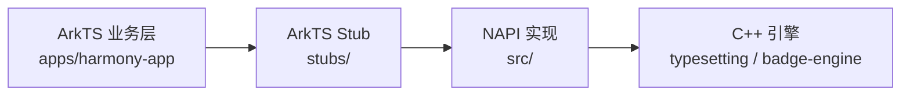

# NAPI Bridge 设计

## 目标

把 `typesetting`（C++ 排版）和 `badge-engine`（C++ 徽章）的能力，以 NAPI 模块形式暴露给 ArkTS。

## 三层结构

| 层 | 责任 |
|---|---|
| ArkTS Stub | 给业务层 IDE 智能提示用，运行时由 N-API 替换 |
| NAPI 实现 | 参数解包、生命周期、结果组装 |
| C++ 引擎 | 真正的排版 / 徽章计算 |

## 边界规则

- NAPI 文件**不允许**直接写业务逻辑
- C++ 引擎**不允许**依赖任何 ArkTS / HarmonyOS 头文件
- Stub 文件签名必须与 NAPI 实现 1:1 对齐

## 当前导出函数

| 函数 | 状态 | 说明 |
|---|---|---|
| `layoutHtml(html, opts)` | 🟡 雏形 | 仅返回布局摘要，未返回完整页面树 |
| `relayout(...)` | ⚪ 未实现 | W24-W26 计划 |
| `hitTest(x, y)` | ⚪ 未实现 | W24-W26 计划 |
| `getSentences()` | ⚪ 未实现 | W24-W26 计划 |
| `computeBadge(stats)` | ⚪ 未实现 | 视 badge-engine Harmony 渲染方案而定 |

## 引擎升级流程

`typesetting` 或 `badge-engine` 出新版本时：

1. 在引擎仓 tag 新版本
2. 本仓 `CMakeLists.txt` 改 git submodule 或 fetch SHA
3. 跑 `cmake --build build` 验证桥接编译通过
4. 升 `napi-bridge-vX.Y.Z` 标签
5. monorepo `apps/harmony-app/oh-package.json5` 引用新版本

详见 [04-native-engine-sync-strategy.md](https://gitee.com/readmigo/readmigo-cn-repos/blob/main/docs/architecture/04-native-engine-sync-strategy.md)。
